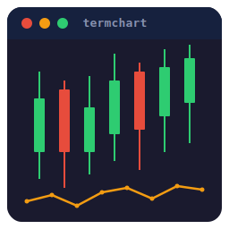

# Termchart - Terminal Charts with Unicode and ANSI Colors

 [](https://badge.fury.io/rb/termchart)  



Render sparklines, line charts, candlestick charts, and bar charts directly in the terminal. Pure Ruby, zero dependencies.

All chart types render to plain strings with ANSI color codes — composable with any TUI framework (rcurses, curses, or raw terminal output).

<br clear="left"/>

## Features

- **Sparklines** — compact single-line charts using ▁▂▃▄▅▆▇█
- **Line charts** — high-resolution braille dot plotting (2×4 dots per cell)
- **Candlestick charts** — OHLC financial charts with green/red coloring
- **Bar charts** — horizontal and vertical with sub-cell precision
- **256-color and RGB** — supports integer color codes and hex strings
- **No dependencies** — pure Ruby, no native extensions
- **String output** — no direct terminal I/O, works anywhere

## Installation

```bash
gem install termchart
```

Or add to your Gemfile:

```ruby
gem 'termchart'
```

## Sparklines

Map values to 8 eighth-block characters on a single line.

```ruby
require 'termchart'

puts Termchart.spark([1, 3, 5, 2, 8, 4, 6])
# => ▁▃▅▂█▄▆

puts Termchart.spark([10, 20, 30, 25, 40], color: :green)
# => ▁▃▅▄█  (in green)
```

Supported color names: `:red`, `:green`, `:blue`, `:yellow`, `:cyan`, `:magenta`, `:white`, `:gray`, `:orange`

## Line Charts

Braille-dot line charts with Y-axis labels. Each terminal cell provides 2×4 sub-pixel resolution via Unicode braille patterns (U+2800–U+28FF).

```ruby
chart = Termchart::Line.new(width: 60, height: 20)
chart.add(prices, color: 82, label: "SPY")
chart.add(gold,   color: 226, label: "GLD")
puts chart.render
```

Output:
```
 460┤⠀⠀⠀⠀⠀⠀⠀⠀⠀⠀⠀⠀⠀⠀⠀⠀⠀⠀⠀⢀⠔⠊⠢⡀⠀⠀⠀⠀⠀⢀⡠⠊
    │⠀⠀⠀⠀⠀⠀⠀⠀⠀⠀⠀⠀⠀⠀⠀⠀⠀⢀⠔⠁⠀⠀⠀⠈⠢⡀⠀⢀⠔⠊
    │⠀⠀⠀⠀⠀⠀⢀⡠⠤⠒⠢⡀⠀⠀⠀⣀⠔⠁⠀⠀⠀⠀⠀⠀⠀⠈⠔⠁
 440┤⠀⠀⠀⢀⡠⠊⠁⠀⠀⠀⠀⠈⠢⡠⠊⠁
    │⠀⠀⣀⠃⠀⠀⠀⠀⠀⠀⠀⠀⠀⠁
    │⠀⡰⠁
 420┤⡰⠁
     ━━ SPY
```

## Candlestick Charts

OHLC candlestick charts for financial data. Green for up candles, red for down.

```ruby
chart = Termchart::Candle.new(width: 60, height: 20)
chart.add([
  { o: 100, h: 105, l: 98,  c: 103 },
  { o: 103, h: 107, l: 101, c: 99  },
  { o: 99,  h: 104, l: 97,  c: 102 },
  { o: 102, h: 108, l: 100, c: 106 },
])
puts chart.render
```

Uses `│` for wicks and `█` for bodies. Y-axis labels on the left at 5 price levels.

## Bar Charts

Horizontal and vertical bar charts with sub-cell precision using eighth-block characters.

### Horizontal

```ruby
chart = Termchart::Bar.new(width: 40, orientation: :horizontal)
chart.add("GLD", 185.50, color: 226)
chart.add("SPY", 450.00, color: 82)
chart.add("SLV", 22.30,  color: 245)
puts chart.render
```

```
GLD │███████████▏            185.50
SPY │████████████████████████    450
SLV │█▍                       22.30
```

### Vertical

```ruby
chart = Termchart::Bar.new(width: 30, height: 10, orientation: :vertical)
chart.add("Q1", 80, color: 82)
chart.add("Q2", 95, color: 82)
chart.add("Q3", 70, color: 196)
chart.add("Q4", 110, color: 82)
puts chart.render
```

## Colors

All chart types accept colors as:

| Format | Example | Description |
|--------|---------|-------------|
| Integer | `82` | 256-color palette index |
| Hex string | `"FF0000"` | RGB hex (with or without `#`) |
| Symbol | `:green` | Named color (sparklines only) |

## Canvas API

For custom visualizations, use the canvas classes directly.

### Canvas

Character grid where each cell holds a character, foreground color, and background color.

```ruby
canvas = Termchart::Canvas.new(40, 10)
canvas.set(5, 3, "█", fg: 196, bg: 233)
puts canvas.render
```

### BrailleCanvas

Each cell maps to a 2×4 braille dot grid for sub-cell resolution.

```ruby
canvas = Termchart::BrailleCanvas.new(40, 10)
# Pixel space: 80×40
canvas.set_dot(15, 25, fg: 82)
puts canvas.render
```

## Use with rcurses

Termchart is designed to compose with [rcurses](https://github.com/isene/rcurses) panes:

```ruby
require 'rcurses'
require 'termchart'

pane = Rcurses::Pane.new(2, 2, 60, 20)
chart = Termchart::Line.new(width: 60, height: 20)
chart.add(data, color: 82, label: "Price")
pane.text = chart.render
pane.refresh
```

## License

Unlicense — Public Domain

## Author

Geir Isene — https://isene.com
